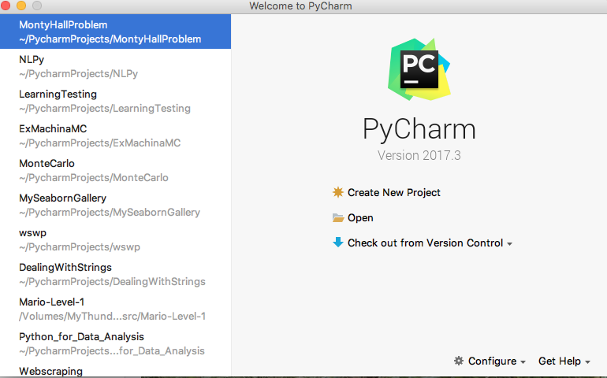
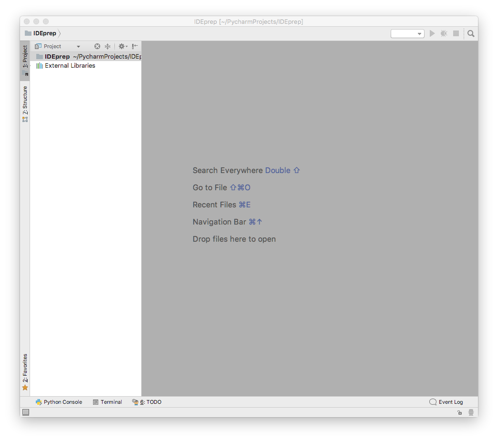
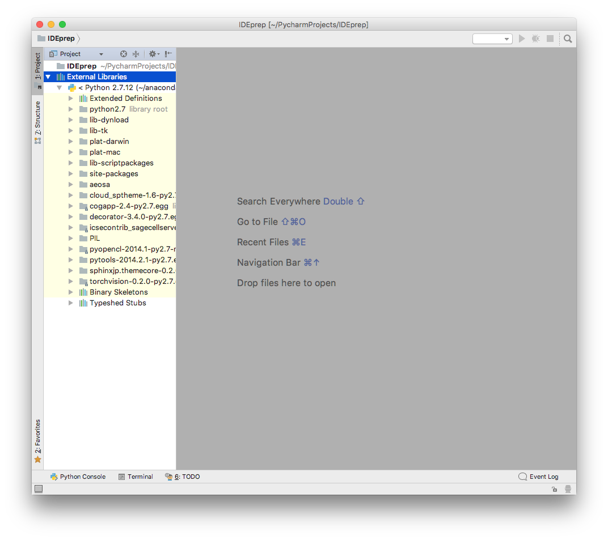
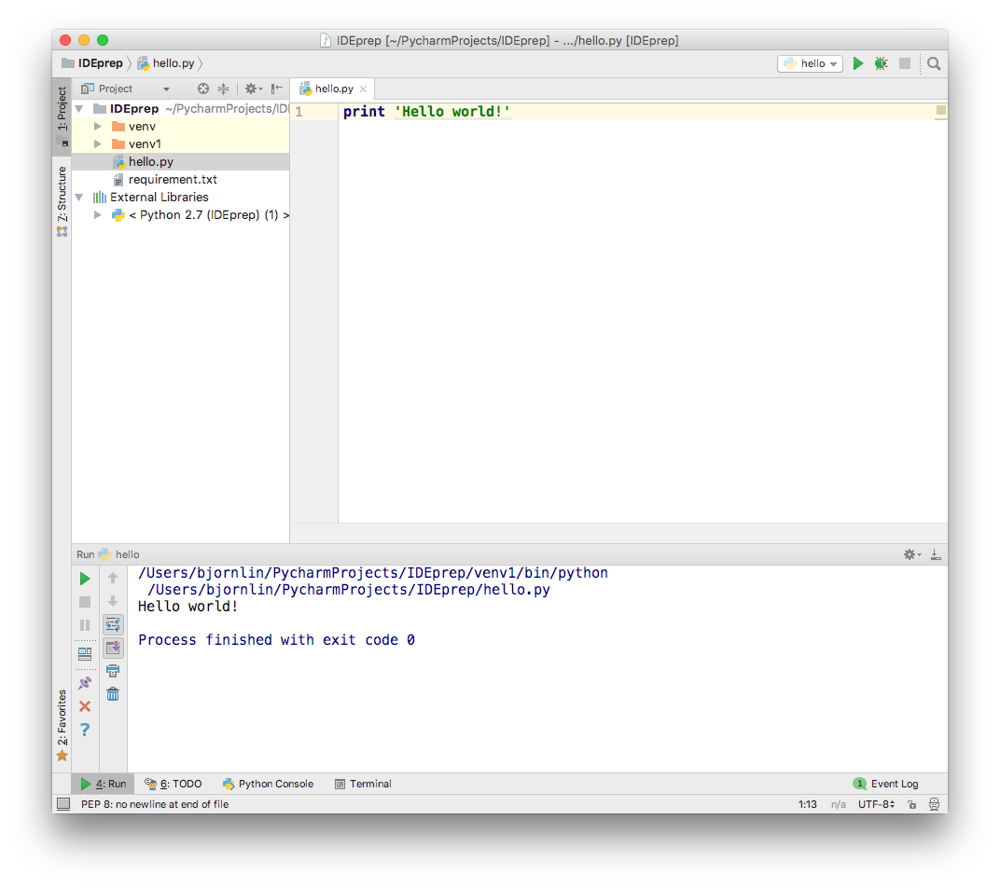
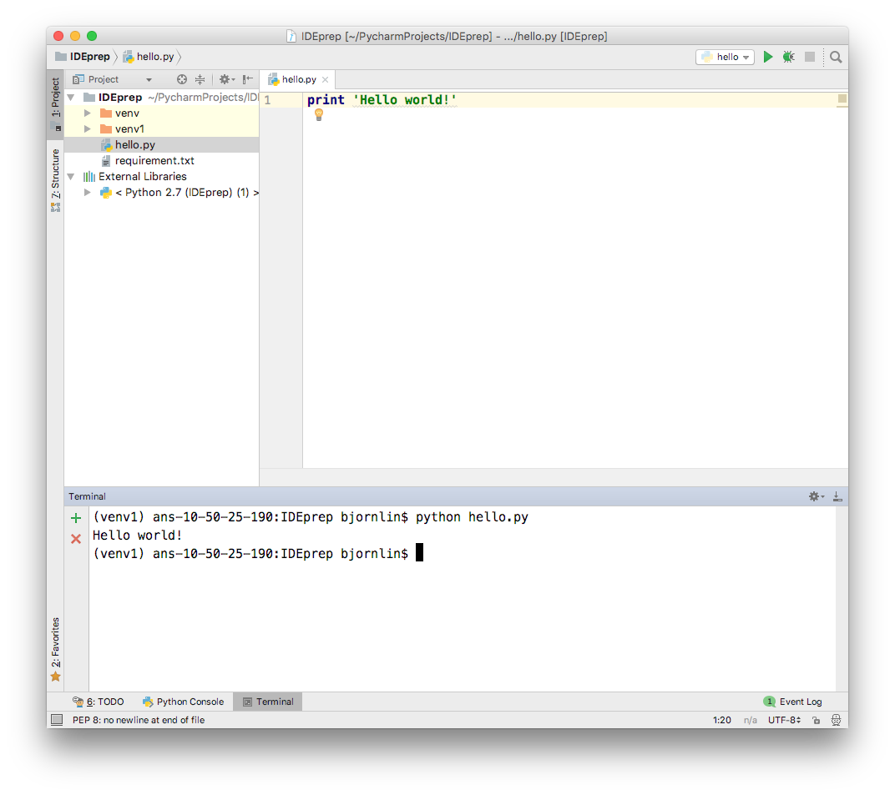
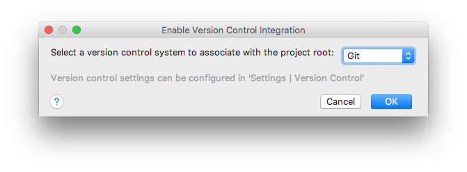
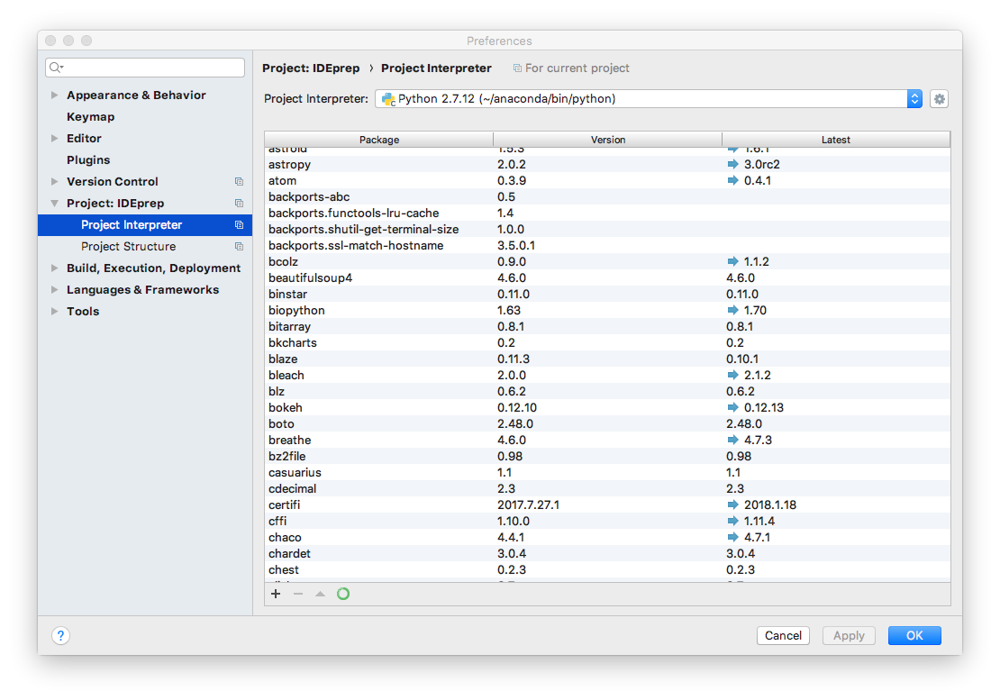
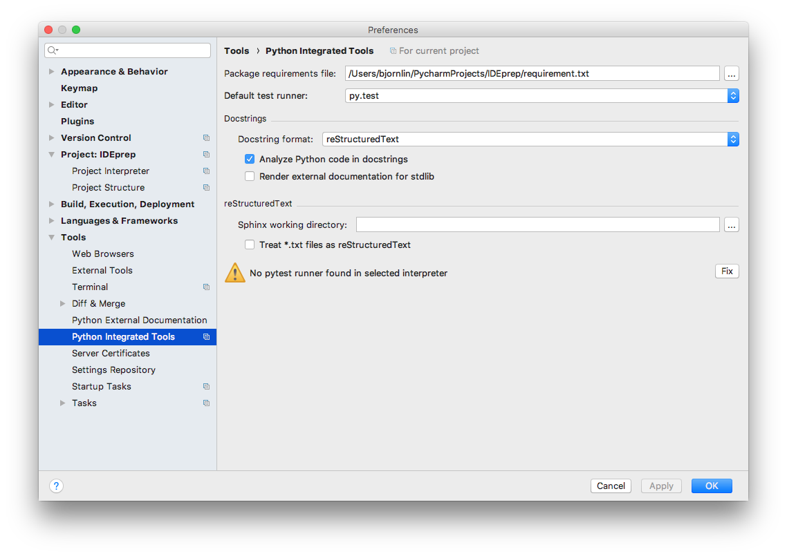
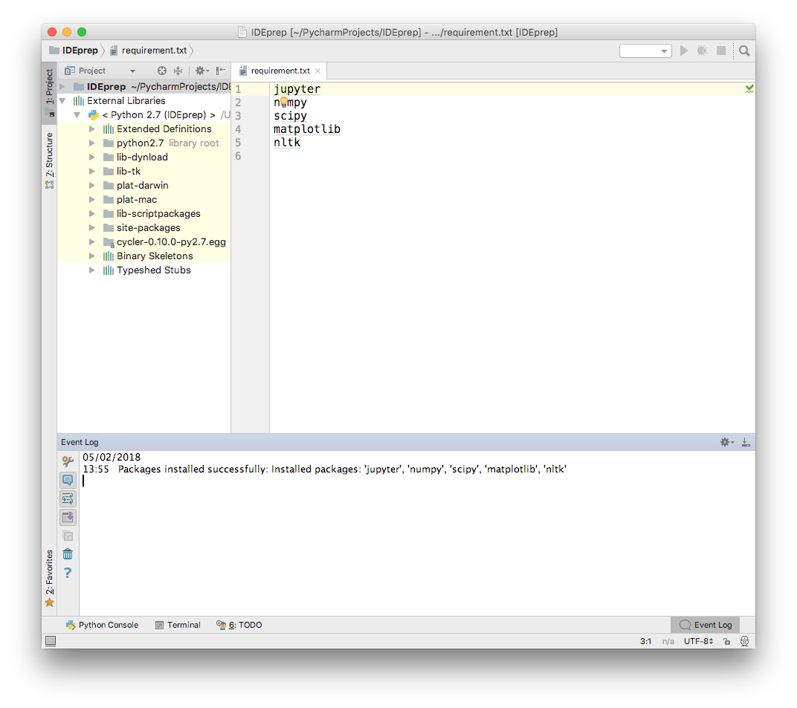

# Introduction to PyCharm

In this we will go through the main parts of PyCharm. We have selected PyCharm as the tool to demonstrate,
and at the same time motivating the use of Integrated Development Environments. We want to show you why
IDEs are useful.

We start by creating a project.
 - Start PyCharm
 - In the dialog "Welcome to PyCharm", choose "Create New Project"
-  Give the project directory a appropriate name, like "IDEpreparation"



### PyCharm environment
The screen is divided in a project area and a gray canvas. The project shows our files and the
Python Interpreter PyCharm has selected for us.


This is currently an empty project. It contains the default setup for a project with a Python Interpreter.
If you double click on "External Libraries", you will see your Python Environment.



Note, if you want to remove a view select the "Black&&White"-vertical bar. For a horizontal view,
there will be a corresonding horizontal bar.

### Executing a Python File
Create a python file by selecting a "File"->"New"->"Python File". Call the file `hello`, and add the following
code to the file:

```python
print 'Hello World!'
```
The file can be excuted by selecting "Run"->"Run". The output from the execution will disappear
by select the "Red X".



It is also possible to execute the code in a terminal which is part of PyCharm.



### Enabling Version Control
When you start a new project Version Control, you must enable your preferred Version Control system.
You do this by selecting "VCS"->"Enable Version Control Integration". Here you can select Git.


Notice how the colors of the file name in project view changes from black to red. Files with red file-
names are not under version control, files with green filenames are under version control but modified,
and files with black filenames are under version control but unmodified.

### The Project Interpreter
Under "Preferences->Project:IDEprep->Project Interpreter-> "Add local" (the mechanical wheel) is it possible
to configure your interpreter environment. Once you select "Add local", you get a dialog where you can
select type of interpreter and type of package manager you want to use (if you have both a regular Python 
and Python from Anaconda.org installed)

#### Create environment


We will change the Project Interpreter.
Select "PyCharm->Preferences->Project:<project-name>->ProjectInterpreter"
Here we can select our preferred  Python Environment.

We create a new Python virtual environment, and this is established in our project area under
the venv sub-directory:

### Requirements.txt
Python Code often comes with a list of required modules which is installed with pip. Here we show you
how you can install necessary modules listed in the file requirements.txt. (The pip installation tool
uses requirements.txt as example file in its documetation).

```txt
numpy
scipy
matplotlib
pandas
scikit-learn
```

### Installing and upgrade numpy

### Running Pytest

### Code Inspection
Select "Code"->"Code Inspection". As we see, there is a lot of PEP8 code warnings. On right side
of the source code, the PEP-8 warnings are shown.

We will change the preferences such that PEP8 warnings get more pronounced.
Select "PyCharm"->"Preferences". Search for PEP8. Select "PEP8 coding style violation" and change
it from "Weak Warning" to "Warning" (Yellow color). Do the same for "PEP8 naming convention".

Select a warning-> select the light bulb -> Rename element -> Rename all occurrences
Select expression with parenthesis -> Remove redundant parenthesis


### PyCharm integrates many Version Control Systems
This exampled is enabled with Git and we can browse the commit log.

Define a new remote and push the code.

##  Why to use and IDE?

The keyword is: **INTEGRATED**
 
###  Bjarne Stroustrup writing about Development and Design (The Programming Language C++, edition 3)
  - Design and programming are iterative activities
  - The systems we construct tend to be at the limit of the complexity that  we and our tools can handle
  - There are no "cookbook" methods that can replace intelligence,experience, and good taste in design and programming  
  - Successful software development is a long-term activity
  - The most important single aspect of software development is to be clear about what you are trying to build
  - **The different phases of a software project, such as design, programming, and testing, cannot be strictly separated**
  - Programming and design cannot be considered without also considering the management of these activities.

"It is easy - typically expensive - to underestimate any of these points. It is hard to transform the abstract ideas they embody into practice. The need for experience should be noted. Like boat building, bicycling, and programming, design is not a skill that can be mastered through theoretical study alone."


Remember, you never see the scaffolding!!

### You should use an IDE because...
it alleviates the process of instantiating your abstract ideas:
- decreases pain
- boosts effectiveness
- best-practice

- ±multi functional
- ±need to learn new tool
 
