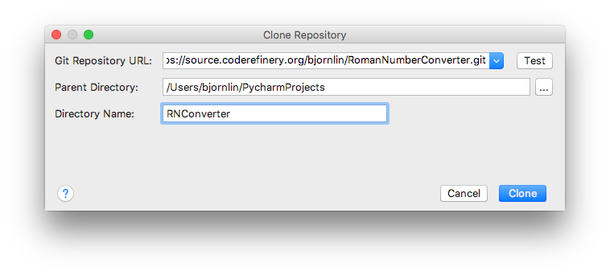
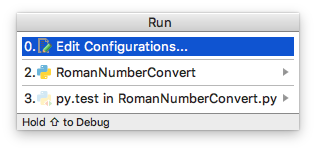
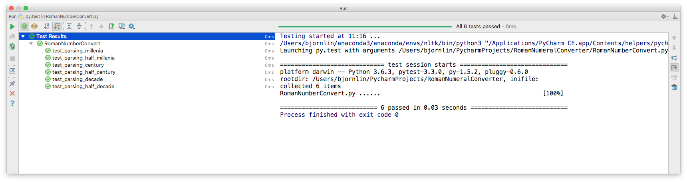
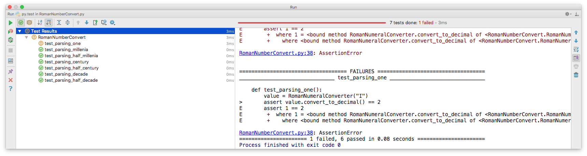
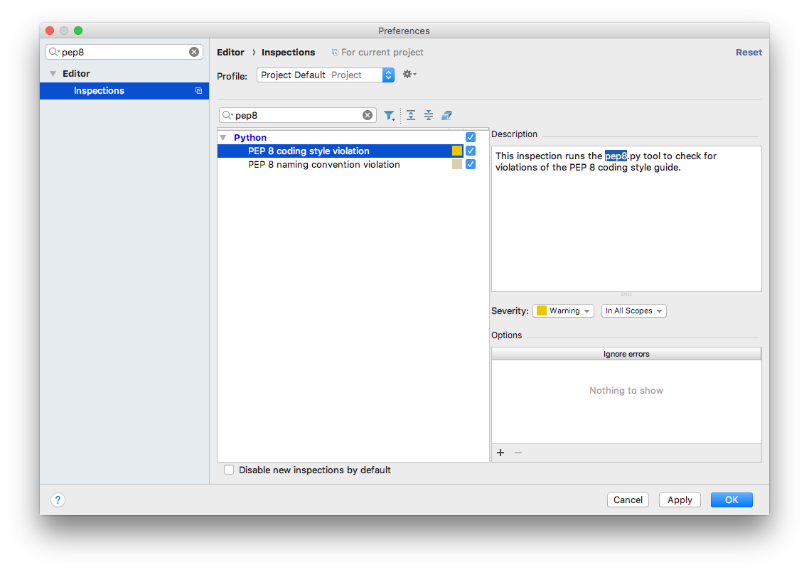
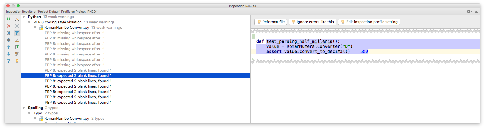

# What is an Integrated Development Environment (IDE)


An Integrated Development Environment (IDE) brings you "everything" you need to be a productive programmer to your finger tips. Does this make sense in when working with research software? Take a look
at Bjarne Stroustrup's general statements about Software Development and Design. 

###  Bjarne Stroustrup writing about Development and Design (The Programming Language C++, edition 3)
  - Design and programming are iterative activities
  - The systems we construct tend to be at the limit of the complexity that  we and our tools can handle
  - There are no "cookbook" methods that can replace intelligence,experience, and good taste in design and programming  
  - Successful software development is a long-term activity
  - The most important single aspect of software development is to be clear about what you are trying to build
  - **The different phases of a software project, such as design, programming, and testing, cannot be strictly separated**
  - Programming and design cannot be considered without also considering the management of these activities.

The value proposition of an IDE is to make this process more efficient.


The plausibility of this value proposition very much depend upon your line of work;
 - How much software development you do?
 - How large code base you depend upon?
 - Do you share code with others and so on.

The pro is that an IDE really integrates features you need. The cons is that you need to learn the in-and-outs of the IDE,
especially the keyboard shortcuts, to reap the benefits.    

## Introduction to PyCharm

We will go through the main parts of PyCharm. We have selected PyCharm as the tool to demonstrate,
and at the same time motivating the use of Integrated Development Environments. We want to show you why
IDEs are useful.

We start by creating a project.
 - Start PyCharm
 - In the dialog "Welcome to PyCharm", choose "Create New Project"
 - Give the project directory an appropriate name, like "Introduction_to_IDE"
 - Note: You can configure line separators between functions, line numbers, white spaces via (configure -> editor -> general -> appearance)


### PyCharm environment
The screen is divided in a project area and a gray canvas.


This is currently an empty project. It contains the default setup for a project with a Python Interpreter.
If you double click on "External Libraries", you will see your Python Environment.


Note, if you want to remove a view select the "Black&&White"-vertical bar. For a horizontal view,
there will be a corresonding horizontal bar.

### Executing a Python File

Create a python file by selecting a "File"->"New"->"Python File". Call the file `hello`, and add the following
Python code to the file:

```python
from __future__ import print_function

print('Hello World!')
```

The file can be excuted by selecting "Run"->"Run". The output from the execution will disappear
by select the "Red X".


It is also possible to execute the code in a terminal which is part of PyCharm.


### Creating tasks and tracking unfinished work
- How do you track tasks that require feedback/attention from other researchers?
- Use `#TODO` or `#FIXME` to track unfinshed work
- The TODO tool window lists all the tasks marked as TODO or FIXME (case insensitive)
- For example, add TODO: add documentation 
- You can add a custom pattern via (configure -> editor -> TODO)


### The Project Interpreter
Under "Preferences->Project:IDEprep->Project Interpreter-> "Add local" (the mechanical wheel) it is possible
to configure your interpreter environment. Once you select "Add local", you get a dialog where you can
select type of interpreter and type of package manager you want to use (if you have both a regular Python 
and Python from Anaconda.org installed)

#### Create environment


We will change the Project Interpreter.
Select "PyCharm->Preferences->Project:<project-name>->ProjectInterpreter"
Here we can select our preferred Python Environment.

We create a new Python virtual environment, and this is established in our project area under
the venv sub-directory:

### Manage dependencies
Python Code often comes with a list of required modules which is installed with pip. Here we show you
how you can install necessary modules. In python, requirements.txt is commonly used for managing dependencies. 

#### Create requirements.txt file in the root directory of the project

To configure this as default requirements file


Now add some requirements to `requirements.txt`
```txt
numpy
scipy
```
If you look at the python files, you will see notifications about requirements that has to be installed.
The event log will state that the installation of the packages where succesfully.


### Enabling Version Control
When you start a new project Version Control, you must enable your preferred Version Control system.
You do this by selecting "VCS"->"Enable Version Control Integration". Here you can select Git.


Notice how the colors of the file name in project view changes from black to red:
 - Files with red filenames are not under version control
 - Files with green filenames are under version control but are modified
 - Files with black filenames are under version control but are unmodified.
 - Files with blue filenames are under version control, modified but not staged for commit.

The version control dialog let you add and commit the files, similar to git on the command line. To commit
`hello.py` select "VCS -> Git -> Add" and then "VCS->Commit":


There is a short-cut to the version control log at the bottom edge of the PyCharm Window. The log is also
accessible from "VCS"->"Git"->"Show History"

- Make changes and see the differences between working directory and last commit. 
- You can see the git branch history and log from the Version Control tool window. 

#### Checking out a project from GitHub or another public Git Repository
From the "VCS" menu it also possible to check-out source code from Github or other repositories. Here is an
example, choose "VCS"->"Checkout from Version Control"->"Github". You will get an dialog look like:


The address to the repository is

```
https://source.coderefinery.org/bjornlin/RomanNumberConverter.git
```

Choose a project name for the cloned source. PyCharm opens the cloned repository as a separate project.
This project is just one file which defines a class and some test cases. Based on the naming it seems
that this is class which can convert Roman Numbers to integers. The different tests supports also this.

The tests are written with pytest. To run this tests you will need pytest installed. You can check the
python packages installed under "Preferences->Project:<your project name>"->Project Interpreter.

If you do not find pytest in your package listing, select "Plus" and search for pytest in the new Dialog.

PyCharm will recognize the tests as written according to pytest. If you select "Run"->"Run", you will have
"py.test in RomanNumberConverter.py" as one execution option.



After executing the pytest, you should get a result like this, all test passed.


How will it look if test fails? Add the following code at the bottom of the source code.

```python
def test_parsing_one():
    value = RomanNumeralConverter("I")
    assert value.convert_to_decimal() == 2
```
You get a red result. Select "test_parsing_one" and the view shows you what went wrong with this one test.


### Code Inspection
We will do Code Inspection to see how well this code adheres to the [PEP8 Style Guide for Python code](https://www.python.org/dev/peps/pep-0008/).
By default PyCharm have set violations of the PEP8 Style Guide to 'weak warning'. We will modify
the setting such that violations of the PEP 8 Style Guide is more pronounced.

Open "PyCharm"->"Preferences" and search for `pep8`. Change the severity regarding violation of PEP8
coding style and naming convention from `weak warning` to `warning`.


Having done that, do the code inspection by selecting "Code"->"Code Inspection". PyCharm produce 
a view with the individual violations. The source code is also colored in areas where the 
violations happen.


You can select the each warning and reformat the file, removing the PEP8-violations. 


### You should use an IDE because...
it alleviates the process of instantiating your abstract ideas:
- decreases pain
- boosts effectiveness
- best-practice

- ±multi functional
- ±need to learn new tool
 
