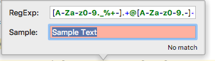
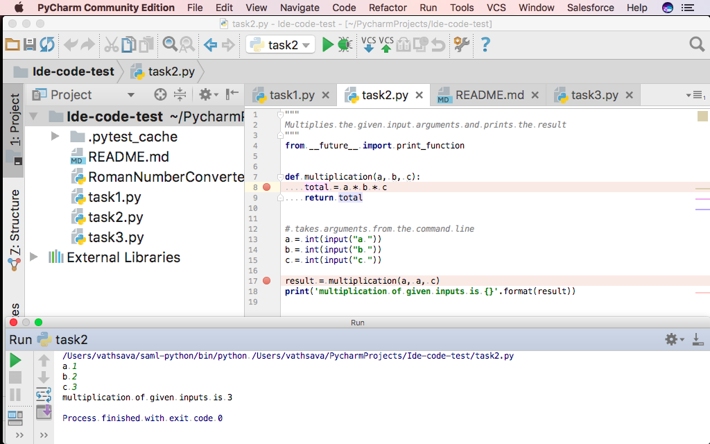
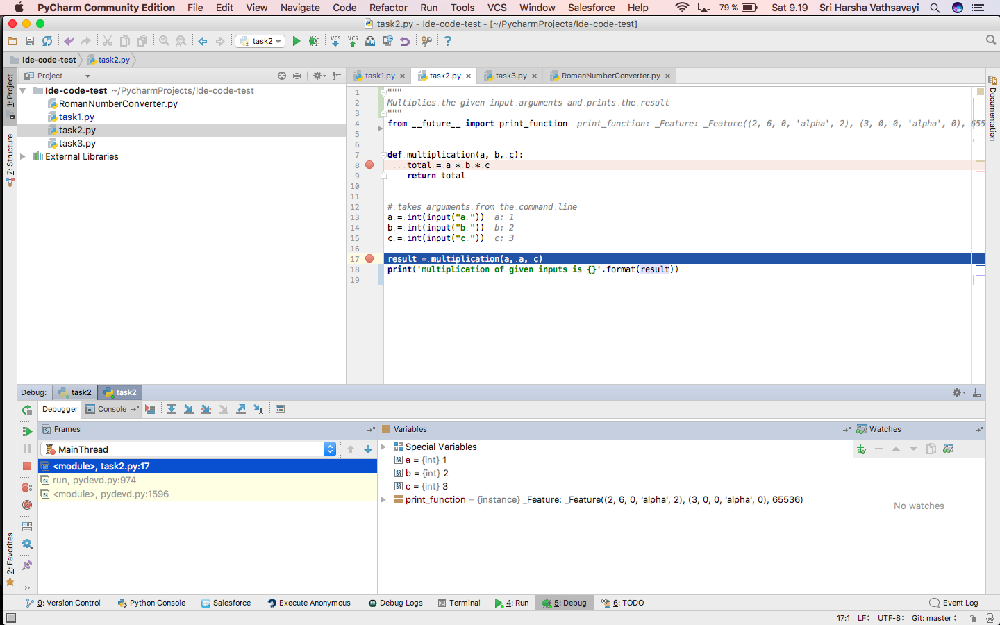

# PyCharm Coding && debugging

If you haven't forked and cloned [this repository](https://github.com/Vathasav/ide-examples.git) in the earlier lesson, please clone it.

### A small type along example

Open task1 and do as per the TODO tasks.
```python
"""
Counts the most common words
in a given text.
"""
from __future__ import print_function
import re
from collections import Counter

s = "Turku is a city on the southwest coast of Finland at the mouth of the Aura River"

# find all words in the string
#TODO: type following code "words = re.findall('[a-zA-Z_]+', s)" below, as you type you get support from PyCharm

# counts the number each time a word appears
#TODO: type following code "word_counts = Counter(words)" below

print('words in given text are {}'.format(dict(word_counts)))

```

As we type, we get support from PyCharm - it completes quite a few of our intentions.
 - ```import``` help with what to import, show most frequent used first
 - Quick documentation for functions (F1 in Mac, Ctrl+Q in windows )
 - Quick definition for functions (cmd+Y in Mac, Ctrl+Shift+I in windows)
 - You can navigate to function declaration and see what the function is supposed to do
 - External documentation is available, and you can add your own through "Settings/Preferences" (Search doc)
 - Help you with regular expressions. Place cursor near "findall"
 
By clicking on the light bubble, you can select checking of the regular expression.



Note: you can set custom keyboard keys using keymapper in "Settings/Preferences".

### Debugging
We will demonstrate PyCharm's debugger. Open task2. It contains some code which asks user input (integers)
and multiplies the input

When we execute this program, we are asked to enter a, b and c.

```python
"""
Multiplies the inputs given by user and prints the result
"""
from __future__ import print_function

def multiplication(a, b, c):
    total = a * b * c
    return total


# takes arguments from the command line
a = int(input("a "))
b = int(input("b "))
c = int(input("c "))

result = multiplication(a, a, c)
print('multiplication of given inputs is {}'.format(result))
```
First run the program normally, to experience its behavior. The program asks for input.
The actual result deviates from the expected result.

Let us debug the code by placing breakpoints. For example, let us see the input inside the multiplication function by placing breakpoint in it. 
Set breakpoints in the program by pointing
the mouse between line 8 and push the mouse button. Do this once more at line 17.
Execution is stop at these points when the code is executed in the debugger.

First run the program normally, to experience its behavior. The program asks for input.



The breakpoints do not influence the execution of the program. Once it as calculated a result,
select the "Red Square" to stop the execution. "The Red X" remove the session.

Next, execute the program under the control of the debugger. Select "Run"->"Debug". Note, that
there is two "Debug". First time you run something in the debugger, you need to need to select
the lower one in the dialog.


The debugger will execute the program until it hits a break point. At the break point it is
possible to inspect the state of the program. The debugger present this to us:



In the code, the state of the variables are printed. PyCharm call this inline debugging and it
is a replacement for your print statements, which you would otherwise add to the code for
getting the state of different variables.

On left, in the debugger view is the different call frames. The ones in light yellow background are from the debugger.
The one(s) without any background is from our code. In middle are the variables in the current
scope.

By selecting the green "Play"-button, the code will execute to the next break point. 

#### Stepping
The view provides several stepping "buttons", use the
one with a red line through it, "Step into my code".  See how the variables are updated inline.

### Exercise: Correct the code snippet in task3.

The description of the task is given in the beginning of the code. The actual result deviates from the expected result. Correct the code so that it satisfies the description.
```python
"""
Code to demonstrate debugging behavior of PyCharm
It takes nth number and
1) calculates the sum of 1 to n digits, i.e., 1+2+3+ ...+n
2) multiplies from 1 to n digits, i.e., 1*2*3* ...*n

If input is given as 4, then
1) sum = 10 (1+2+3+4)
2) multiplication = 24 (1 * 2 * 3 * 4)
"""
from __future__ import print_function

def demo(n):
    sum = 0
    multiplication = 0

    for i in range(n):
        sum = sum + i

    print('sum is {}'.format(sum))

    for x in range(n):
        multiplication = multiplication * n

    print('multiplication is {}'.format(multiplication))


input_number = int(input('enter nth number: '))
print(input_number)
demo(input_number)

```

### Code refactoring

We can refactor the `demo function` in above code into separate functions for addition and multiplication
- How do you normally divide existing code into functions?
- Pycharm can do it on behalf of us

Select the code from which you want to create a function and then Right click -> refactor -> extract -> method


- Give appropriate name and configure input parameters and output
- Also helps in refactoring method names and method signatures, etc


### Good to know - features

- We can configure external editor (for example, emacs, vim) via Settings/Preferences -> Tools -> External tools
- Execute small aspects of code in console to check if something is working or not
- Change indentation by ctrl + alt + i
- Supports markdown
    - You need to install markdown plugin from **Settings/Preferences -> Plugins** and restart PyCharm
    - Click file `README.md` and add some text to it. Click Show editor and preview on the right upper corner.
- Sphinx can be used from PyCharm as well via **Tools -> Sphinx Quickstart** (if sphinx is installed in your environment) 
