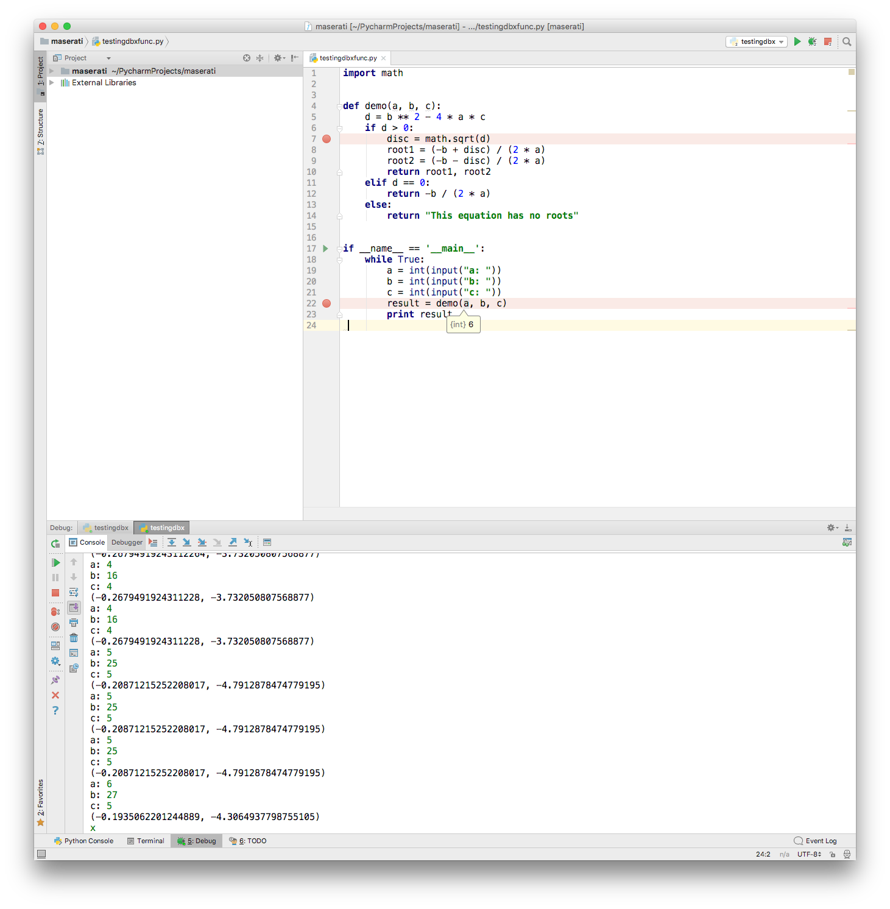
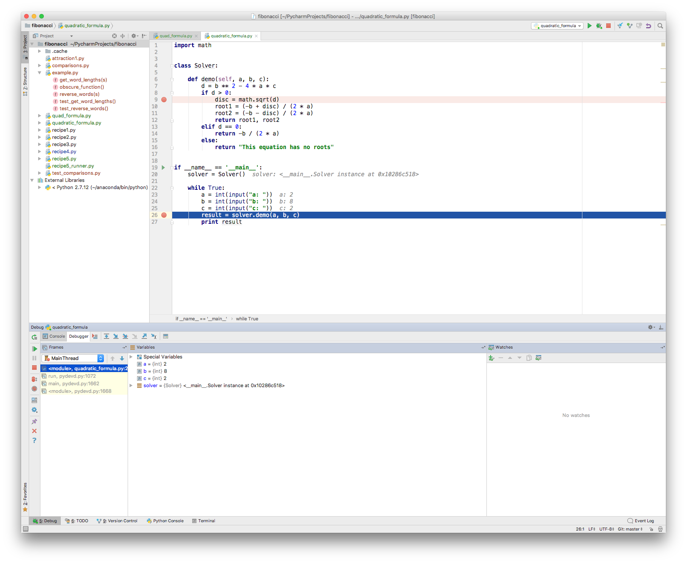
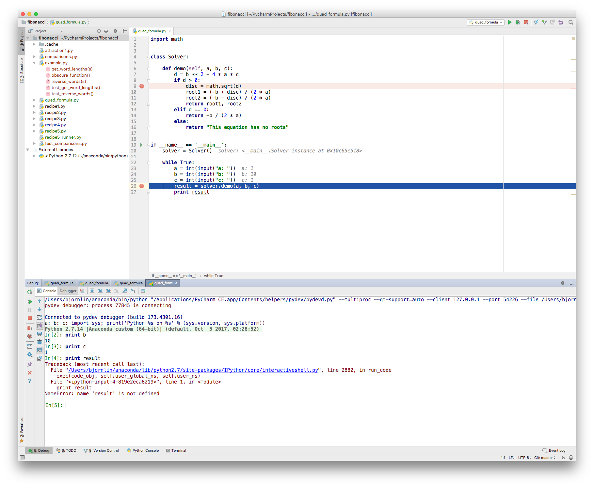

# PyCharm Coding && debugging

### A small coding example

Code to type (from the matplotlib gallery):
```python
  """
  ===================
  A simple fill plot
  ===================
  This example showcases the most basic fill plot a user can do with matplotlib
  """

  import numpy as np
  import matplotlib.pyplot as plt

  x = np.linspace(0,1,500)
  y = np.sin(4 * np.pi * x)*np.exp(-5*x)

  fig, ax = plt.subplots()

  ax.fill(x,y,zorder=10)
  ax.grid(True, zorder=5)
  plt.show()

```
Create new file. As we type, we get support from PyCharm - it completes quite a few of our intentions.
 - ```import``` help with what to import, show most frequent used first
 - Quick documentation for functions
 
 - External documentation is available, and you can add your own through "Preferences" (Search doc)
 - Help you with regular expressions. Test this code in a new file
 
 ``` python
import re

p=re.compile('[A-Za-z0-9._%+-].+@[A-Za-z0-9.-]+\.[A-Za-z]{3,4}')
```
By clicking on the light buble, you can select checking of the regular expression.


### Debugging
We will demonstrate PyCharm's debugger. Here is some code which takes terminal input (integers)
and calculate the roots of a quadratic equation:
$ ax^2 + bx + c = 0$
When we execute this program, we are asked to specify a, b and c.

```python
import math


class Solver:

    def demo(self, a, b, c):
        d = b ** 2 - 4 * a * c
        if d > 0:
            disc = math.sqrt(d)
            root1 = (-b + disc) / (2 * a)
            root2 = (-b - disc) / (2 * a)
            return root1, root2
        elif d == 0:
            return -b / (2 * a)
        else:
            return "This equation has no roots"


if __name__ == '__main__':
    solver = Solver()

    while True:
        a = int(input("a: "))
        b = int(input("b: "))
        c = int(input("c: "))
        result = solver.demo(a, b, c)
        print result
```

Paste code in a new file named quadratic_formula.py. Set breakpoints in the program by pushing,
the left mouse button at line number 9 and 26. Execution is stop at these points when the code
is executed in the debugger.

First run the program normally, to experience its behavior. The program asks for input.

The breakpoints do not influence the execution of the program. Once it as calculated a result,
select the "Red Square" to stop the execution. "The Red X" remove the session.

Next, execute the program under the control of the debugger. Select "Run"->"Debug". Note, that
there is two "Debug". First time you run something in the debugger, you need to need to select
the lower one in the dialog.


The debugger will execute the program until it hits a break point. At the break point it is
possible to inspect the state of the program. The debugger present this to us:


In the code, the state of the variables are printed. PyCharm call this inline debugging and it
is a replacement for your print statements, which you would otherwise add to the code for
getting the state of different variables.

On left, in the debugger view is the different call frames. The ones in light yellow background are from the debugger.
The one(s) without any background is from our code. In middle are the variables in the current
scope. The variable result has not come into existence yet.

It possible to inspect the program from a Python Console, by select the fan "Console" and the
graphical figure with a prompt (>_).


By selecting the green "Play"-button, the code will execute to the next break point. 

#### Stepping
The view provides several stepping "buttons", use the
one with a red line through it, "Step into my code".  See how the variables are updated inline.
Note that the frame view has increased since the code called demo().


