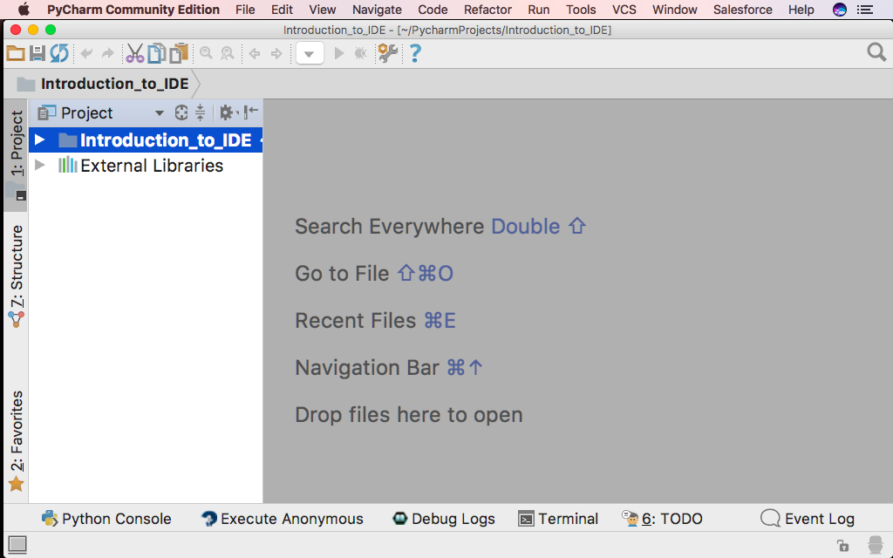
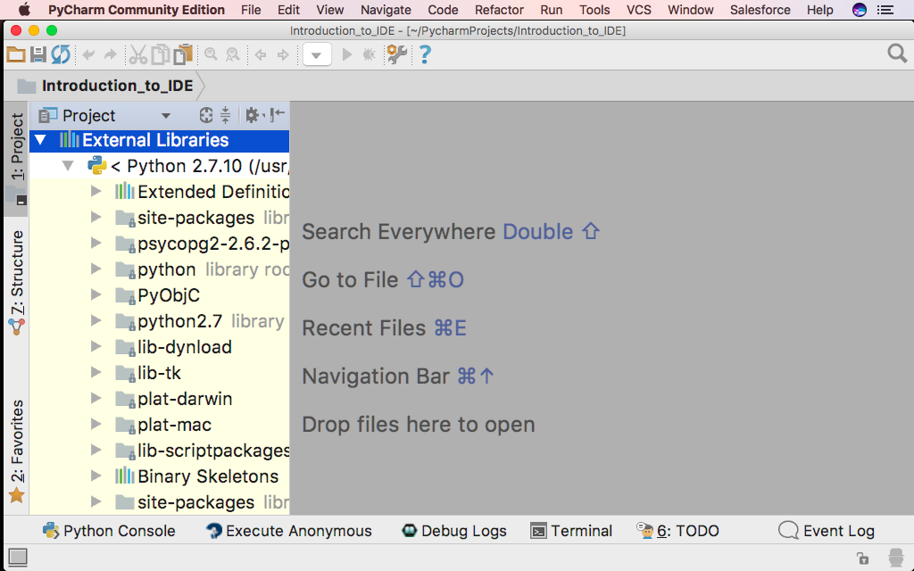
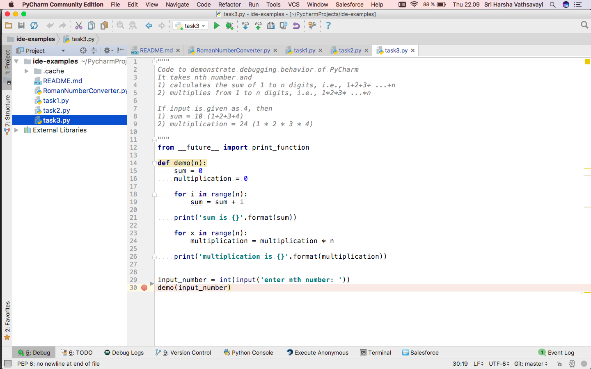
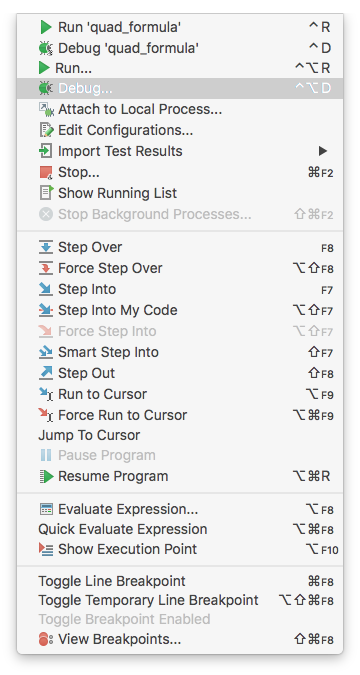
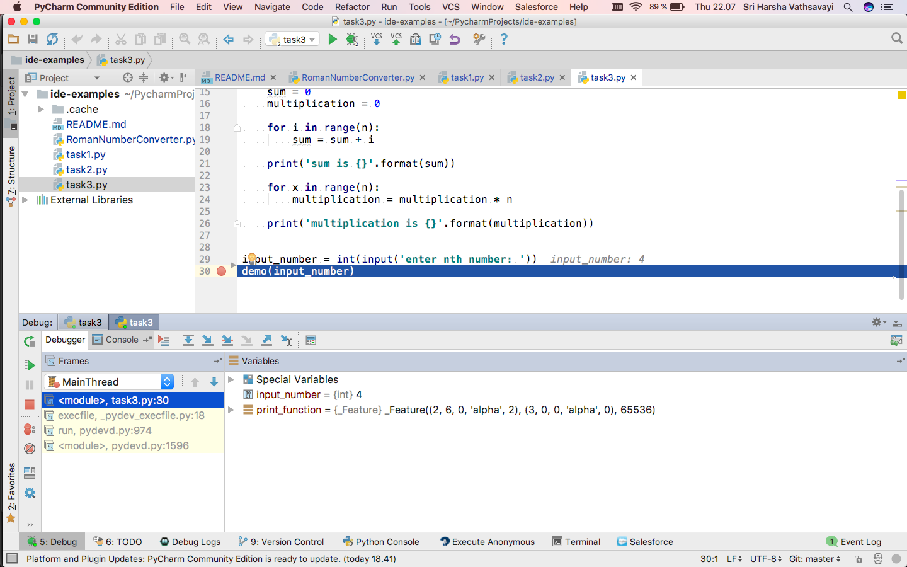
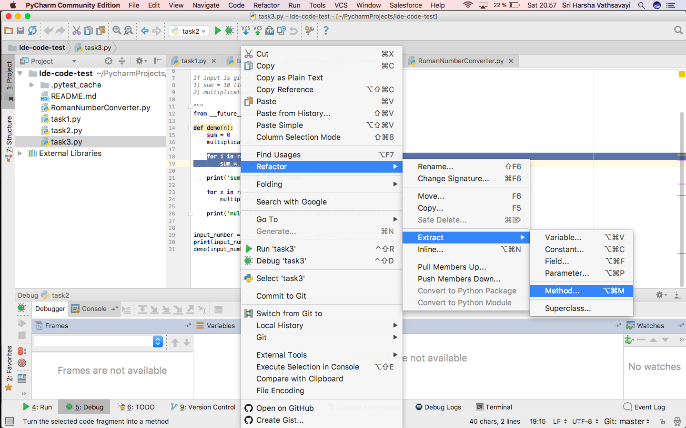

## Integrated Development Environments (IDEs)

In this lesson we will give overview of an IDE and its functionality. We have selected PyCharm as the IDE to demonstrate the use of Integrated Development Environments. We want to show you how
IDEs integrate features necessary for developing code.

Note: Most of the IDE's offer similar features and support the functionality that we discuss in this lesson. This demonstration is relevant
for other IDE's as well.

We start by creating a project.
 - Start PyCharm
 - In the dialog "Welcome to PyCharm", choose "Create New Project"
 - Give the project directory an appropriate name, like "Introduction_to_IDE"
 - Note: You can configure line separators between functions, line numbers, white spaces via (configure -> editor -> general -> appearance)


### PyCharm environment
The screen is divided in a project area and a gray canvas.



This is currently an empty project. It contains the default setup for a project with a Python Interpreter.
If you double click on "External Libraries", you will see your Python Environment.



Note, if you want to remove a view select the "Black&&White"-vertical bar. For a horizontal view,
there will be a corresonding horizontal bar.

### Executing a Python File

Create a python file by selecting a "File"->"New"->"Python File". Call the file `demo`, and add the following
Python code to the file:

Note: the code is not working according to specification, we will fix it later by debugging

```python
"""
Code to demonstrate debugging behavior of PyCharm
It takes nth number and
1) calculates the sum of 1 to n digits, i.e., 1+2+3+ ...+n
2) multiplies from 1 to n digits, i.e., 1*2*3* ...*n

If input is given as 4, then
1) sum = 10 (1+2+3+4)
2) multiplication = 24 (1 * 2 * 3 * 4)

"""
from __future__ import print_function

def demo(n):
    sum = 0
    multiplication = 0

    for i in range(n):
        sum = sum + i

    print('sum is {}'.format(sum))

    for x in range(n):
        multiplication = multiplication * n

    print('multiplication is {}'.format(multiplication))


input_number = int(input('enter nth number: '))
demo(input_number)
```

The file can be executed by selecting "Run"->"Run". The output from the execution will disappear
by select the "Red X".

### PyCharm Settings/Preferences dialog {#Configure}

- **Windows and Linux** - *File -> Settings* 
- **macOS** - *PyCharm -> Preferences*

### Creating tasks and tracking unfinished work
- How do you track tasks that require feedback/attention from other researchers?
- We can add `#TODO` or `#FIXME` before code to track unfinshed work
- The TODO tool window lists all the tasks marked as TODO or FIXME (case insensitive)
- For example, add TODO: add documentation 
- You can add a custom pattern via [Settings/Preferences](#Configure) -> editor -> TODO

### Debugging with PyCharm

First run the *demo* program normally, to experience its behavior. The program asks for input.
The actual result deviates from the expected result.

Let us debug the code by placing breakpoints. Set breakpoints in the program by pointing
the mouse on the line you want to examine and push the mouse button.



Execute the program under the control of the debugger. Select "Run"->"Debug". Note, that
there is two "Debug". First time you run something in the debugger, you need to select
the lower one in the dialog.


The debugger will execute the program until it hits a break point. At the break point it is
possible to inspect the state of the program. The debugger present this to us:



In the code, the state of the variables are printed. PyCharm call this inline debugging and it
is a replacement for your print statements, which you would otherwise add to the code for
getting the state of different variables.

By selecting the green "Play"-button, the code will execute to the next break point. 

#### Stepping
The view provides several stepping "buttons", use the
one with a red line through it, "Step into my code".  See how the variables are updated inline.

#### Exercise: Correct the demo snippet by placing break points


### Code refactoring

We can refactor the `demo function` in above code into separate functions for addition and multiplication
- How do you normally divide existing code into functions?
- Pycharm can do it on behalf of us

Select the code from which you want to create a function and then Right click -> refactor -> extract -> method



- Give appropriate name and configure input parameters and output
- Also helps in refactoring method names and method signatures, etc

### Good to know - features

- We can configure external editor (for example, emacs, vim) via Settings/Preferences -> Tools -> External tools
- Execute small aspects of code in console to check if something is working or not
- Change indentation by ctrl + alt + i
- Supports markdown
    - You need to install markdown plugin from **Settings/Preferences -> Plugins** and restart PyCharm
    - Click file `README.md` and add some text to it. Click Show editor and preview on the right upper corner.
- Sphinx can be used from PyCharm as well via **Tools -> Sphinx Quickstart** (if sphinx is installed in your environment) 

### IDE vs Code editor

- IDE's do many things like Code Editors
    - Debugging support
    - version control integration

- In addition, they offer more support for underlying environment
    - running a local server
    - database integration
    - code refactoring
    - plugins for managing code dependencies

- Mainly, limited to one particular language or environment

### Pros and Cons of IDE...
it alleviates the process of instantiating your abstract ideas:
- boosts effectiveness
- best-practice

- ±not open-source
- ±quite heavy
